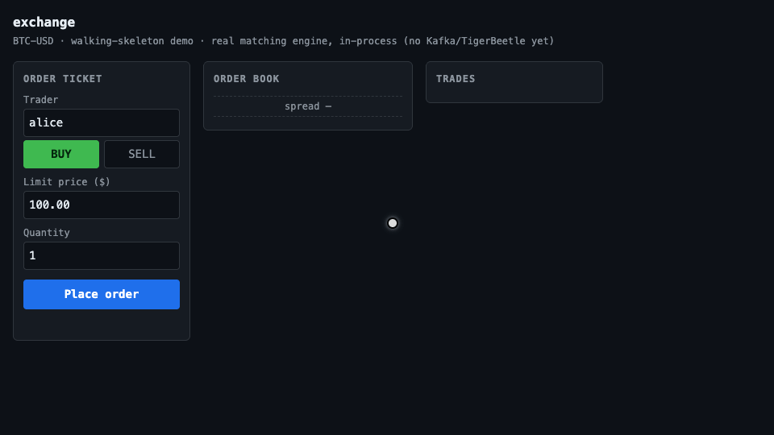
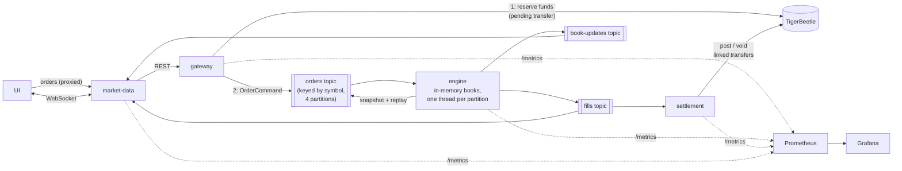

# exchange

[](https://github.com/rvsiyad/exchange/actions/workflows/ci.yml)



A mini trading venue. Clients place orders through a REST gateway, an event-sourced
in-memory matching engine crosses them over Kafka, fills settle atomically as
two-phase transfers in TigerBeetle, and a market-data service streams the live
order book to a dashboard over WebSockets.

## Demo

The demo UI runs on the real event-sourced pipeline: orders enter through the
gateway, cross in the engine, and the book you see is projected back out of the
log by market-data — **gateway → Kafka → engine → Kafka → market-data**. (The
session-2.5 walking skeleton ran the same UI directly on the in-process matcher;
the guts were swapped without changing the UI contract.)

```
docker compose up -d redpanda redpanda-init tigerbeetle
./mvnw -q install -DskipTests
./mvnw -q -pl engine exec:java &
./mvnw -q -pl settlement exec:java &
./mvnw -q -pl gateway exec:java &
./mvnw -q -pl market-data exec:java
```

Then open http://localhost:8090 and trade as the funded demo users `alice` and
`bob` (balances at `GET :8091/api/balances?userId=alice`). Orders reserve their
worst-case cost in TigerBeetle before they reach the log — an order you cannot
afford is rejected by the ledger database itself with a 422. Ports/config via
`KAFKA_BOOTSTRAP`, `TIGERBEETLE_ADDRESS` (3000), `GATEWAY_PORT` (8091),
`MARKET_DATA_PORT` (8090), `MARKET_DATA_WS_PORT` (8092), `GATEWAY_URL`,
`ENGINE_SNAPSHOT_DIR`, `ENGINE_SNAPSHOT_EVERY`, and `*_METRICS_PORT` for the
four Prometheus scrape targets (gateway 7001, engine 7002, settlement 7003,
market-data 7004).

The page rides the WebSocket feed (snapshot on connect, deltas after): the
book, tape, and TigerBeetle balances update live, and a dropped or evicted
connection self-heals by reconnecting for a fresh snapshot
([ADR 0005](docs/adr/0005-fanout-backpressure.md)).

## Design

Matching happens in memory on purpose — putting a database in the matching hot path
is an anti-pattern; durability comes from the Kafka event log plus snapshots, the
same architecture real exchanges use. Money correctness is delegated to a
purpose-built ledger database that enforces balance invariants itself: orders hold
their worst case as TigerBeetle pending transfers at entry, fills settle as one
atomic linked chain (post both holds, re-reserve remainders, pay out of escrow),
cancels void — and no application code ever checks a balance. Built in Java 21 as
a Maven multi-module monorepo.



An order's life, end to end:

```mermaid
sequenceDiagram
    participant C as Client
    participant G as gateway
    participant T as TigerBeetle
    participant K as Kafka
    participant E as engine
    participant S as settlement
    C->>G: POST /api/orders
    G->>T: create PENDING transfer (reserve worst case)
    T-->>G: ok — or insufficient funds → 422
    G->>K: OrderCommand → orders (key = symbol, acks=all)
    G-->>C: 202 (durably in the log; fills arrive on the tape)
    K->>E: consume (single writer per partition)
    E->>E: match, price-time priority
    E->>K: Fill + BookUpdate events
    K->>S: consume fills (idempotent, replays from start)
    S->>T: post reservations + pay out, one LINKED chain
    Note over S,T: cancel → VOID pending transfer (release)
```

| Module | Responsibility | Concurrency story |
|---|---|---|
| `common` | Event schemas, JSON serde, metrics registry | shared, dependency-light |
| `ledger` | Every TigerBeetle conversation: accounts, reserve/post/void, invariant reads | thread-safe client; invariants enforced by the database |
| `gateway` | REST order entry, validation, fund reservation, Kafka producer | virtual thread per request |
| `engine` | Event-sourced matching, snapshot + replay | **single writer per partition** — lock-free by architecture |
| `settlement` | Fills → linked transfer chains | idempotent consumer, exactly-once *effect* |
| `market-data` | Book/tape projection, WebSocket fanout, demo UI | bounded per-client queues, slow-consumer eviction |
| `storm` | Whole-system property test | the proof: invariants under randomized concurrency |
| `bench` | Open-loop latency benchmark | the numbers: percentiles under constant load |

Decisions are written up as ADRs — [single writer per
partition](docs/adr/0001-single-writer-per-partition.md), [TigerBeetle +
Postgres split](docs/adr/0002-tigerbeetle-plus-postgres.md), [the log is the
database](docs/adr/0003-event-sourced-engine.md), [reservation beats
check-then-debit](docs/adr/0004-pending-transfer-reservation.md), [fanout
backpressure](docs/adr/0005-fanout-backpressure.md) — and the running lab
notebook is [docs/LEARNING.md](docs/LEARNING.md).

## Proving correctness: the order storm

`./mvnw -pl storm test` assembles the real gateway, engine and settlement over
real Kafka and TigerBeetle, storms them with 8 concurrent users firing 800
randomized orders and cancels (funding deliberately tight, so the ledger
rejects some), and then asserts the invariants that define a financial system
— no matter how the orders interleaved:

- **conservation of money**: everything the treasury issued is in a user
  account, and escrow nets to exactly zero once settlement catches up
- **no negative balances**, any user, any asset
- **every fill settled exactly once**, proven by the deterministic transfer
  ids in the ledger
- **book ↔ ledger agreement**: the holds implied by the engine's final
  snapshots equal the ledger's pending reservations to the cent
- **no crossed books**

The scenario derives from one seed (printed on every run); a failure
reproduces with `-Dstorm.seed=<seed>`. The interleaving is deliberately not
reproducible — every run tries a new one against the same invariants. The
storm runs in CI on every push.

## Performance

Measured with an open-loop, coordinated-omission-safe harness
(`./mvnw -pl bench test -Dbench=true`): constant offered load, latency from
the *scheduled* send time, warm-up discarded, HdrHistogram percentiles.
Order→fill spans the whole pipeline — HTTP → gateway (TigerBeetle reserve +
Kafka publish, `acks=all`) → engine match → `fills` topic observed.

At 1,000 orders/s sustained for 60s, everything settled, on an Apple M4
(one box, services in one JVM, Redpanda + TigerBeetle in containers):

| | p50 | p90 | p99 | p99.9 |
|---|---|---|---|---|
| order→fill | 1.2ms | 7.5ms | 19.5ms | 62.9ms |

The matching path holds p99 under 30ms to 2,000 orders/s; the measured
bottleneck is settlement (one linked TigerBeetle chain per fill, single
consumer), which saturates near ~1,000 fills/s — batching chains into one
TigerBeetle submission is the designed-for fix. Full methodology, all rates,
and the two findings worth reading: [docs/benchmarks.md](docs/benchmarks.md).

## Deploying

One VM runs the whole venue: infra in Docker, the four services as systemd
units on packaged jars (`./mvnw package` produces executable jars), and CD
redeploys on every merge to `main` once the target's secrets exist —
[deploy/README.md](deploy/README.md) is the walkthrough, sized for Oracle's
free-tier ARM shape.

## Observability

Every service serves Prometheus metrics on its own port; the compose
Prometheus scrapes them and a provisioned Grafana dashboard at
http://localhost:3001/d/exchange shows orders/s, fills/s, settlement lag,
per-partition engine load (the hot-symbol tradeoff of ADR 0001, live),
rejections by reason, and feed clients/evictions. The dashboard ships with
the repo — `docker compose up -d prometheus grafana` and it exists.
